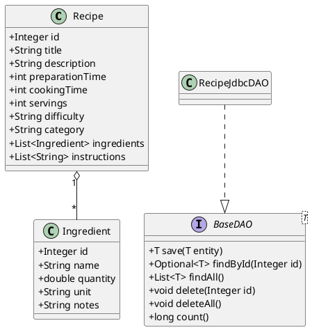
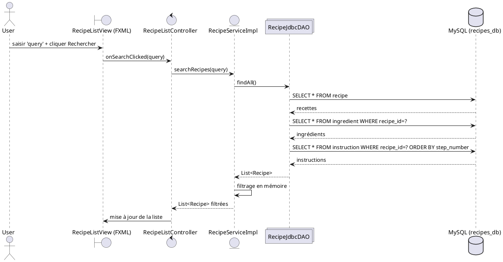
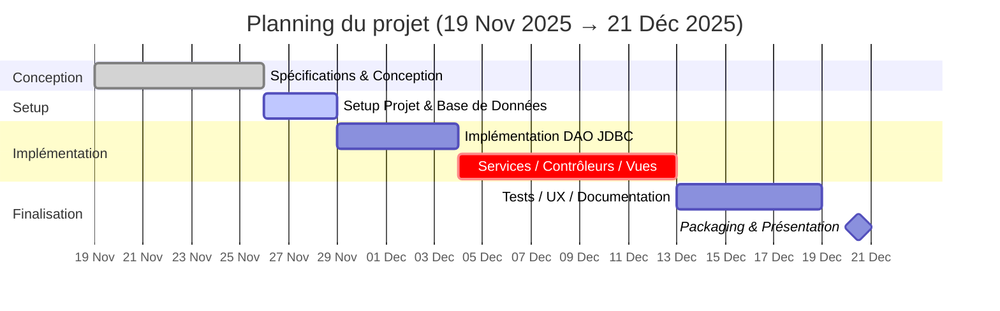

# Recipe Management System — README (FR)

Ce projet est une application de bureau JavaFX pour gérer des recettes de cuisine. Les données sont stockées dans une base MySQL via JDBC.

## Aperçu
- UI JavaFX (FXML + CSS) avec vues: liste et accueil.
- Modèles `Recipe` et `Ingredient` avec services et dépôts.
- Persistance MySQL (`recipes_db`) initialisée via `setup_tables.sql`.

## Prérequis
- JDK 17 et Maven (Windows).
- MySQL 8.x installé en local.
- Accès réseau vers `localhost:3306`.

## Structure
- Sources Java: [src/main/java/com/myapp](src/main/java/com/myapp)
- Vues FXML: [src/main/resources/views](src/main/resources/views)
- Styles: [src/main/resources/styles/styles.css](src/main/resources/styles/styles.css)
- Config DB: [src/main/java/com/myapp/config/DatabaseConfig.java](src/main/java/com/myapp/config/DatabaseConfig.java)

Packages principaux:
- `controllers`: `HomeController`, `RecipeListController`.
- `services`: `RecipeService`, `RecipeServiceImpl`.
- `repositories`: `RecipeRepository`.
- `models`: `Recipe`, `Ingredient`, `BaseModel`.

## Configuration MySQL
- Base et tables: exécuter [setup_tables.sql](setup_tables.sql) sur MySQL (`recipes_db`).
- Identifiants JDBC: éditer [src/main/java/com/myapp/config/DatabaseConfig.java](src/main/java/com/myapp/config/DatabaseConfig.java) pour `URL`, `USERNAME`, `PASSWORD`.
  - Par défaut: `jdbc:mysql://localhost:3306/recipes_db?useSSL=false&serverTimezone=UTC`, utilisateur `root`, mot de passe `p@ssw0rd`.

## Installation
```powershell
mvn -v
mvn clean install
```

## Lancement
```powershell
mvn javafx:run
```

L’application charge la vue [src/main/resources/views/home.fxml](src/main/resources/views/home.fxml) depuis `Main.java`.

## Dépannage
- JavaFX: utilisez JDK 17 (JavaFX 17.0.2). En cas d’erreur de runtime, vérifiez la version du JDK.
- Maven `maven-compiler-plugin`: le `pom.xml` déclare `source/target=17` mais `release=25` avec `--enable-preview`. Si vous rencontrez des erreurs de compilation, alignez `release` sur 17 et retirez `--enable-preview`.
- MySQL: si `Access denied` ou timezone, vérifiez les identifiants et l’URL (`serverTimezone=UTC`). Assurez les droits sur `recipes_db`.

## Fonctionnalités (actuelles)
- Liste et consultation de recettes via JavaFX.
- Services métier (`RecipeService`) et dépôt (`RecipeRepository`) pour CRUD.
- Recherche basique côté service (si implémentée).

## Bonnes pratiques et améliorations
- Externaliser la configuration (fichier `.properties` ou variables d’environnement) au lieu de valeurs codées en dur dans `DatabaseConfig`.
- Ajouter un pool de connexions (HikariCP) et un `rollback` explicite en cas d’exception.
- Ajouter des tests unitaires/intégration (Testcontainers) et améliorer la recherche côté SQL pour éviter le filtrage en mémoire.

## Arborescence (simplifiée)
```
RecipeManagementSystem/
├─ pom.xml
├─ setup_tables.sql
├─ src/
│  ├─ main/
│  │  ├─ java/com/myapp/
│  │  │  ├─ Main.java
│  │  │  ├─ config/DatabaseConfig.java
│  │  │  ├─ controllers/
│  │  │  ├─ repositories/
│  │  │  ├─ services/
│  │  │  └─ models/
│  │  └─ resources/
│  │     ├─ styles/styles.css
│  │     └─ views/
│  │        ├─ home.fxml
│  │        └─ recipe-list.fxml
└─ target/ (généré par Maven)
```

## Commandes utiles (MySQL)
```powershell
mysql -u root -p -e "CREATE DATABASE IF NOT EXISTS recipes_db;"
mysql -u root -p recipes_db < setup_tables.sql
```

## Notes
- Le point d’entrée de l’application est `com.myapp.Main` (JavaFX). Assurez que les ressources sont accessibles sous `/views` et `/styles`.
- Les identifiants MySQL dans `DatabaseConfig` sont à adapter à votre environnement.
  }
  package "config" {
    class DatabaseConfig
  }
}

controllers --> services
services --> dao
controllers --> models
services --> models
dao --> config
@enduml
```

Diagramme de classes simplifié (PlantUML)


Séquence (recherche depuis la vue) — PlantUML


Gantt (Mermaid, pour Kroki/Mermaid Live) — 19 nov 2025 → 21 déc 2025


Outils en ligne utiles
- PlantUML Server: https://www.plantuml.com/plantuml/uml/
- PlantText: https://www.planttext.com/
- Kroki (supporte PlantUML & Mermaid): https://kroki.io/#try
- Mermaid Live Editor: https://mermaid.live/

## Questions fréquentes (préparation orale)

- Polymorphisme (DAO/Service)
  - Service dépend de l’interface `BaseDAO`; `RecipeJdbcDAO` est interchangeable (tests/migration).
- `id` en lecture seule
  - Clé primaire générée par la DB; jamais mise à jour; utilisée seulement dans `WHERE id=?`.
- `save` vs `insert`
  - `save` route: si `id == null` → `insert`, sinon `update`. `insert` insère, récupère la clé, insère les enfants; `update` met à jour et remplace les enfants.
- `BaseModel` comme classe mère
  - Centraliser `id`/comportements communs (futur: timestamps, audit, etc.).
- Pourquoi JDBC simple ?
  - Contrôle fin et pédagogique; peut évoluer vers JPA plus tard.

